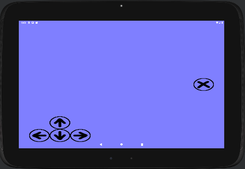

small3d boilerplate
===================

This repository is a basis for building games and other
applications with the small3d game development library
(in C++):

https://github.com/dimi309/small3d

The code is reasonably good. It has been extracted from
the Islet Hell game, which has been published on [Steam](https://store.steampowered.com/app/2069750/Islet_Hell/),
the [Apple App Store](https://apps.apple.com/us/app/islet-hell/id1631875184) and the [Android Play Store](https://play.google.com/store/apps/details?id=dimi309.islethelladroid).

It provides the following:

- A cross platform project in the root folder that can be built using
  conan: https://conan.io/
- Android project (using the same source code with the necessary
  #defines) in the `android` folder.
- iOS project (using the same source code with the necessary
  #defines) in the `ios` folder. It runs on Vulkan, using MoltenVK.
- iOS project (using the same source code with the necessary
  #defines) in the `ios-opengles` folder. It runs on OpenGL ES.

A basic user interface is supported for the abovementioned platforms.
The keyboard arrows and space work on the PC and corresponding
visual controls are provided on mobile:

  
The boilerplate has been published separately from small3d because it 
takes an opinionated approach on how to build small3d-based
projects. small3d on the other hand can be used in many ways.
For example, if you use the library itself without this boilerplate
you are not obliged to build it with conan.io and you can choose
the directory structure of your project.

Notes: 
- Shadow mapping is too slow on the iPad 2.
- The Vulkan ios app does not work on the simulator. It produces the error:
  'Device does not support texture swizzle.'
  This has probably something to do with MoltenVK.

It is assumed that the necessary development tools are installed
on your machine (e.g. gcc, Visual Studio, cmake, conan, 
Android studio, Xcode) depending on the build that interests
you.

# Building on PC (Windows, MacOS, Linux)

Deploy my variation of the portaudio package for conan as a prerequisite:

	git clone https://github.com/dimi309/portaudio-conan
	cd portaudio-conan
	conan export . --version=19.7.0
	
And of course, small3d too:

	git clone https://github.com/dimi309/small3d-conan
	cd small3d-conan
	conan export .
	 
Then clone this repository and build and run the game:

     git clone https://github.com/dimi309/small3d-boilerplate
     cd small3d-boilerplate
     conan build . --build=missing
     cd bin
     ./game
     # (Or just `game` on Windows)
	 
---
**NOTE**

The conan small3d package no longer supports Vulkan. You can always 
use Vulkan with small3d if you build small3d with plain cmake. You
can do so using the scripts available in the [main small3d repository](https://github.com/dimi309/small3d).

Since this boilerplate is "opinionated" and uses conan, I propose 
that you use OpenGL on PC and no longer provide a way to deploy
it with Vulkan.

The boilerplate still supports Vulkan on mobile devices (but there
again, my advice to you is to use OpenGL ES. It is a lot more resilient
to driver quirks and other issues and not because I have not spent
enough time programming the Vulkan renderer and trying to work around
them).

---

# Building for Android

Build small3d for android for your preferred API (Vulkan or OpenGL ES - see small3d README 
file). Then copy:

	small3d/build/include to small3d-boilerplate/android/app/deps/include
	small3d/build/lib to small3d-boilerplate/android/app/deps/lib
	small3d/build/shaders to small3d-boilerplate/android/app/src/main/assets/resources/shaders

Depending on whether you are using OpenGL ES or Vulkan, rename (or copy) one of the files 
`CMakeListsOpenGLES.txt`, `CMakeListsVulkan.txt` in `small3d-boilerplate/android/app` 
to `CMakeLists.txt`.

If building for Vulkan, change the `defaultConfig/minSdk` value to at least 26 in
`small3d-boilerplate/android/app/build.gradle`.

Open and build the project in `small3d-boilerplate/android` with Android studio.

# Building for iOS

Build small3d for ios for your preferred API (Vulkan or OpenGL ES - see small3d README 
file). Then, if using OpenGL ES (recommended) copy:

	small3d/build/include to small3d-boilerplate/ios-opengles/deps/include
	small3d/build/lib to small3d-boilerplate/ios-opengles/deps/lib
	small3d/build/shaders to small3d-boilerplate/ios-opengles/game/resources1/shaders

Then open the project `small3d-boilerplate/ios-opengles/game.xcodeproj` using Xcode.

If using Vulkan copy:

	small3d/build/include to small3d-boilerplate/ios/deps/include
	small3d/build/lib to small3d-boilerplate/ios/deps/lib
	small3d/build/shaders to small3d-boilerplate/ios/game/resources1/shaders

Then open the project `small3d-boilerplate/ios/game.xcodeproj` using Xcode.
